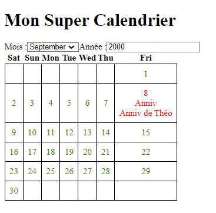

# Calendrier Angular

## Description du Projet

L'application est construite en utilisant Angular et fournie aux développeurs une API sous la forme d'une library. Cette API fournie un composant graphique "Calendrier" Angular qui affiche les jours d'un mois en fonction du mois et de l'année sélectionnée par l'utilsateur. Cette library possède également un affichage d'évènements.
Le projet Consumer est une démo de la library qui montre un exemple d'utilisation de l'API.

## Screenshot



## Prérequis

Avant de commencer, assurez-vous d'avoir les éléments suivants installés sur votre système :

- Node.js et npm : [Télécharger et Installer](https://nodejs.org/)
- Angular CLI : Pour installer Angular CLI, utilisez la commande suivante : `npm install -g @angular/cli`

## Installation

Build le Dockerfile à la racine du repos avec la commande :

```bash
 docker build -t tp1-app-angular .
```

Lancer l'image avec la commande :

```bash
docker run -p 8085:80 tp1-app-angular
```

**OU**

Clonez ce repository sur votre machine locale en utilisant la commande suivante :

```bash
git clone https://gitlab.com/TheoRamousse/tp1angularcalendar.git
```

Naviguez vers le répertoire du projet :

```bash
cd tp1angularcalendar/consumer
```

Installez les dépendances en utilisant npm :

```bash
npm install
```

Démarrez l'application en utilisant la commande suivante :

```bash
ng serve
```

(l'url par défaut du projet est en général localhost:4200)

## Personnalisation

```javascript
<lib-calendar-library defaultStartMonth="September" defaultStartYear="2000" firstDayOfWeek="Sat" [listOfEvents]="listOfEvents">
  <h1 title>Mon Super Calendrier</h1>
</lib-calendar-library>

```

- 2 paramètres peuvent être renseignés pour afficher le calendrier à une date donnée (defaultStartMonth et defaultStartYear)
- Le paramètre firstDayOfWeek permet de faire commencer la semaine un autr jour que lundi
- Une balise de votre choix portant le label 'title' viendra remplacer le titre par défaut du composant calendrier
- Le paramètre listOfEvents est bindé à une liste d'évènements en local. Ces évènements sont présents sous la forme d'une classe exposée par la library

## Auteur

Théo RAMOUSSE
